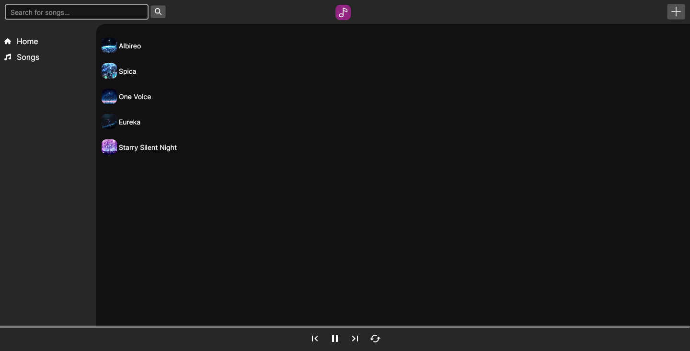

# Riulax
An elegant music player made with Avalonia.

>[!WARNING]
> Work in progress!



## Dependencies
```
libvlc
```

## Roadmap
+ [x] Playlist
+ [ ] Albums
+ [x] Duration
+ [ ] Home page
+ [ ] Frequently played
+ [ ] Saved session
+ [ ] Queues

+ [ ] Flatpak publishing
+ [ ] .rpm package
+ [ ] .deb package
+ [ ] Windows executable

# Contributing
## Prerequisities
+ .NET 8.0 SDK
+ vlc-devel (if Linux)

To build or run this application:
1. Clone this repository and cd into it.
2. `dotnet build` or `dotnet run`.
3. It should do its thing.

For testing, use `dotnet watch src/Riulax.csproj` for hot reloading. (Might be buggy, but that is just how it is, be sure to manually reload for big changes)

## Building a release executable
1. Use:
```bash
$ dotnet build -c Release -r <rid>

# rid can be either: `win-x64` or `linux-x64`
```
2. Locate into `bin/Release/net8.0/<rid>/publish`.
3. The final release executable should be in this folder.